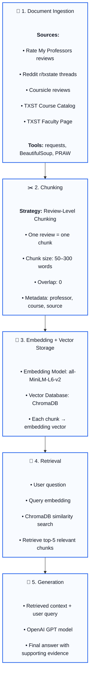

## Domain

This project focuses on unofficial student knowledge about Computer Science professors and courses at Texas State University. It answers questions about what each professor actually tests, whether students mention curves, how useful office hours are, how difficult the workload is, and which professor or section might best fit a student's needs.

This domain is valuable because official resources like the course catalog explain what a course covers, but they do not describe what the class is actually like from a student perspective. Students often spend hours reading professor reviews, Reddit posts, grading comments, and course discussions before registration. A RAG pipeline can simplify that process by collecting those scattered sources and helping students make faster, more informed course decisions.

---

## Documents

| # | Source | Description | URL or location |
|---|--------|-------------|-----------------|
| 1 | Subreddit : r/txst |  This subreddit thread covers what students think are good professors for 3358 and 2318. | https://www.reddit.com/r/txstate/comments/1c0xw5d/advice_about_cs_professors_cs_33582318
| 2 | TXST official catalog website | This is the offcial course catalog for CS at TXST. It is useful for contrasting with what students say.|  https://mycatalog.txstate.edu/courses/cs/
| 3 | TXST CS faculty page|This gives an overview of what subject professors teach.|https://cs.txst.edu/people/faculty.html |
| 4 | Rate my professor| This gives professor Koh lee's rate my professor reviews for courses taught at TXST |https://www.ratemyprofessors.com/professor/56546 |
| 5 | Rate my professor| This gives professor Husain Gholoom rate my professor reviews for courses taught at TXST | https://www.ratemyprofessors.com/professor/1755852 |
| 6 | Rate my professor| This gives professor Martin Burtscher rate my professor reviews for courses taught at TXST | https://www.ratemyprofessors.com/professor/1508396 |
| 7 | Rate my professor| This gives professor Mina Guirguis rate my professor reviews for courses taught at TXST | https://www.ratemyprofessors.com/professor/1118377 |
| 8 | Rate my professor| This gives professor Oleg Komogortsev rate my professor reviews for courses taught at TXST | https://www.ratemyprofessors.com/professor/1132554 |
| 9 | Rate my professor| This gives professor Jill Seaman rate my professor reviews for courses taught at TXST | https://www.ratemyprofessors.com/professor/1828652 |
| 10 | Rate my professor| This gives professor Ted Lehr rate my professor reviews for courses taught at TXST | https://www.ratemyprofessors.com/professor/1909698 |
| 11 | Rate my professor| This gives professor Ted Lehr rate my professor reviews for courses taught at TXST | https://www.ratemyprofessors.com/professor/1909698 |
| 12 | Rate my professor| This gives professor Keshav Bhandari rate my professor reviews for courses taught at TXST | https://www.ratemyprofessors.com/professor/2676876 |
| 13 | Rate my professor| This gives professor Apan Qasem rate my professor reviews for courses taught at TXST | https://www.ratemyprofessors.com/professor/1071081 |
| 14 | Rate my professor| This gives professor Edwin Vargas rate my professor reviews for courses taught at TXST | https://www.ratemyprofessors.com/professor/2494994 |
| 15 | Rate my professor| This gives professor Trevi Kelley rate my professor reviews for courses taught at TXST | https://www.ratemyprofessors.com/professor/2922018 |
| 16 | Rate my professor| This gives professor Xiaomin Li rate my professor reviews for courses taught at TXST | https://www.ratemyprofessors.com/professor/2831104 |             
| 17 | r/txstate Thread            | Advice about CS Professors (CS 3358 & 2318) | https://www.reddit.com/r/txstate/comments/1c0xw5d/advice_about_cs_professors_cs_33582318 |
| 18 | r/txstate Thread            | Best CS professors at Texas State           | Reddit search: "best CS professors txstate"                                              |
| 19 | r/txstate Thread            | Lee Koh Assembly course discussion          | Reddit search: "Koh assembly txstate"                                                    |
| 20 | r/txstate Thread            | Husain Gholoom Data Structures discussion   | Reddit search: "Gholoom txstate"                                                         |
| 21 | r/txstate Thread            | Martin Burtscher course discussion          | Reddit search: "Burtscher txstate"                                                       |
| 22 | r/txstate Thread            | CS3358 professor recommendations            | Reddit search: "CS3358 professor txstate"                                                |
| 23 | r/txstate Thread            | CS2367 Assembly survival tips               | Reddit search: "CS2367 assembly txstate"                                                 |
| 24 | r/txstate Thread            | Registration advice for CS majors           | Reddit search: "which professor txstate cs"                                              |
| 25 | r/txstate Thread            | General Computer Science program discussion | Reddit search: "computer science texas state reddit"                                     |
| 26 | r/txstate Thread            | Hardest CS classes and professors           | Reddit search: "hardest cs class txstate"                                                |
| 27 | Coursicle Professor Reviews | All Texas State professor reviews           | https://www.coursicle.com/txstate/professors/                                            |
| 28 | Coursicle Course Reviews    | All Texas State CS courses                  | https://www.coursicle.com/txstate/courses/CS/                                            |
| 29 | Coursicle Professor Reviews | Mina Guirguis reviews                       | https://www.coursicle.com/txstate/professors/Mina+Guirguis/                              |

---

## Chunking Strategy

1. Review-level chunking

**Chunk size:**
50–300 words per chunk (typically one review per chunk)
**Overlap:**
0 words
**Reasoning:**
The majority of the corpus consists of student reviews from Rate My Professors, Reddit discussions, and other review platforms. Since each review typically expresses a complete opinion about a professor, course, grading style, exams, projects, or office hours, splitting reviews further would risk losing important context. Therefore, each individual review will be stored as a separate chunk whenever possible.

For Reddit threads, comments will be grouped into chunks of approximately 300–500 words with a 50-word overlap to preserve discussion context between replies. Official sources such as the Texas State course catalog and faculty pages will be chunked by logical sections (one course description or faculty entry per chunk) because these documents are already concise.

This strategy improves retrieval precision because semantic search can directly retrieve the specific student experiences most relevant to a user's question. For example, a query such as "Does Gholoom curve exams?" can retrieve individual reviews mentioning curves rather than an entire professor document containing hundreds of unrelated reviews. The smaller chunk size also improves embedding quality and reduces irrelevant information returned during retrieval.

---

## Retrieval Approach

<!-- Which embedding model are you using (e.g., all-MiniLM-L6-v2 via sentence-transformers)?
     How many chunks will you retrieve per query (top-k)?
     If you were deploying this for real users and cost wasn't a constraint, what tradeoffs
     would you weigh in choosing a different embedding model — context length, multilingual
     support, accuracy on domain-specific text, latency? -->

**Embedding model:**
all-MiniLM-L6-v2 from the Sentence Transformers library. This model is lightweight, efficient, and performs well on semantic search tasks involving student reviews, Reddit discussions, and course information.
**Top-k:**
5 chunks per query. Retrieving the five most relevant chunks provides sufficient context for answer generation while minimizing irrelevant information.
**Production tradeoff reflection:**
If cost and computational resources were not a constraint, I would consider larger embedding models such as BGE-Large or OpenAI embedding models. Larger models generally provide higher retrieval accuracy and better semantic understanding of nuanced questions about professors, exams, grading policies, and teaching styles. I would also consider multilingual embedding models if the system needed to support reviews or queries in multiple languages. However, these benefits come with increased latency, storage requirements, and computational costs. Given the relatively small size of the Texas State Computer Science professor corpus, all-MiniLM-L6-v2 offers a strong balance between retrieval quality, speed, and ease of deployment.
---

## Evaluation Plan

| # | Question | Expected answer |
|---|----------|-----------------|
| 1 | What do students say about surviving Lee Koh's CS2318 Assembly course?| Students say the course requires significant independent time investment outside class. Reviewers note lectures are dense and heavy — you must understand the material deeply, not just memorise. Several mention the textbook and online resources help more than lecture. Effort put into homeworks and projects directly translates to learning the language.|
| 2 | What do students say about Keshav Bhandari's exams in CS2308? | Reviews consistently describe exams as significantly harder than what is covered in lectures. Students report that exam questions cover material not explicitly taught in class. Multiple reviewers warn that attending every lecture and studying all slides is not sufficient to pass — several felt the exam difficulty was disproportionate to the instruction provided. Time pressure on quizzes is also noted.|
| 3 | How do students describe Martin Burtscher's workload in CS4380? | Students consistently describe CS4380 as project-heavy, with projects due every other week and 5–6 hours of project work expected per week. Despite the heavy workload, many reviewers say the course is worth it — the material is directly applicable and Burtscher explains complex parallel programming concepts clearly. A minority of reviews describe him as creating unnecessary obstacles. |
| 4 | How do Jill Seaman and Husain Gholoom compare for CS1428? |  I expect my system tp recommend Seaman as Seaman reviews are mostly positive: students describe her as fair, approachable, and clear for beginners. Gholoom reviews for CS1428 are negative: reviewers  warn beginners to avoid him, citing heavy self-teaching requirements and strict grading.  |
| 5 | How does student feedback about a course differ from the official Texas State course description? | The response should compare catalog topics with student-reported experiences, such as workload, project complexity, exam style, grading practices, and professor-specific expectations.|

---

## Anticipated Challenges

1. Noisy or Contradictory Reviews

Student reviews are subjective and may contradict each other. For example, one student may describe a professor's exams as fair while another describes them as extremely difficult. Because the corpus relies heavily on user-generated reviews from Rate My Professors and Reddit, the retrieval system may surface conflicting opinions. The generated answer should therefore summarize trends across multiple reviews rather than relying on a single source.1.

2. Off-Topic Retrieval

Some reviews discuss topics unrelated to the user's question, such as parking, online course formats, or personal experiences that do not answer questions about exams or grading. Semantic search may occasionally retrieve these chunks if they contain similar keywords, leading to less relevant answers.

3. Missing Source Attribution

The system combines information from Reddit, Rate My Professors, Coursicle, and official university sources. Without proper metadata and source tracking, users may not be able to distinguish between official course information and student opinions, reducing trust in the generated answers.

4. Incomplete Context from Chunking

If important information is split across multiple reviews or discussion comments, the retrieval system may only return part of the context. For example, one review may describe exam difficulty while another explains the grading curve. Retrieving only one chunk could lead to an incomplete or misleading answer.

---

## Architecture

## Pipeline Diagram

